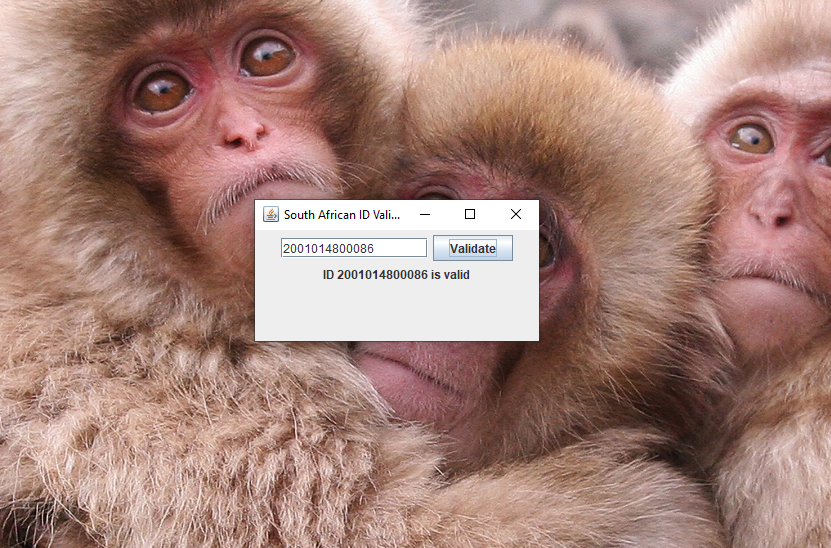
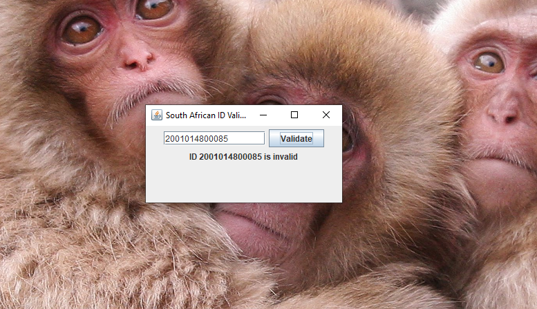

# Validating a South African ID

This project validates South African ID numbers using Java, ensuring they meet the required format and criteria. It includes unit tests to verify the validation logic and a simple UI for user interaction. The project demonstrates robust validation with detailed feedback and thorough testing, as part of the `#unit_testing` practice.

## Project Overview

The application validates South African ID numbers (13 digits, format YYMMDDSSSSCAZ) by checking:
- **Length and Numeric**: Must be 13 digits, all numeric.
- **Date of Birth**: YYMMDD must be a valid date, not in the future (as of 23 April 2025).
- **Gender**: SSSS (0000–4999 for female, 5000–9999 for male).
- **Citizenship**: C (0 for SA citizen, 1 for permanent resident).
- **Fixed Digit**: A (must be 8).
- **Checksum**: Z (validated using the Luhn algorithm).

The project consists of three main files:
- `ValidateSaId.java`: Contains the validation logic, returning a `ValidationResult` with feedback.
- `ValidateSaIdTest.java`: JUnit tests to verify all validation aspects (length, date, gender, citizenship, checksum).
- `App.java`: A Swing-based UI for users to input an ID and view detailed validation results.

## Features 

- Validates South African ID numbers with detailed feedback.
- Comprehensive unit tests ensuring 100% pass rate for all validation criteria.

## DEMO



## Setup Instructions

1. **Clone the Repository**:
   ```bash
   git clone <https://github.com/1632Pelma/unit_testing>
   cd unit_testing

## Features to be implemented
- Provides user-friendly UI to input IDs and see results, including:
  - Date of birth
  - Gender (Male/Female)
  - Citizenship (South African Citizen/Permanent Resident)
  - Checksum status
